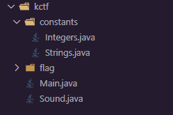
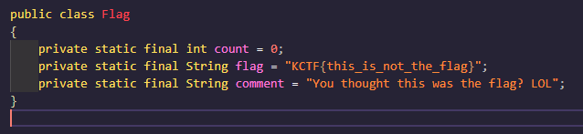
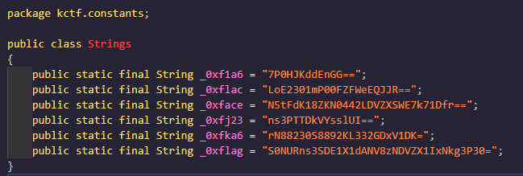

# DROID FLAG

- Date: `2022-01-24`
- Author: `AtomicNicos`
- Category: `Reverse Engineering`
- Points: `50`

## Challenge text

During my holiday in Bahamas, I met a baby shark. The shark wanted to sing me something but couldn't. Can you sing that for me?

[Download Link](https://kctf2022.nstechvalley.com/knight-ctf-2022-challenges/Reverse%20Engineering/Baby%20Shark/)

Flag Format: `KCTF{SomE_T3xT_h3r3}`

## Description

One needs to decompile the provided JAR, and understand what the decompiled code does, to retrieve the flag.

## Resolution

Once the JAR is downloaded, go to [javadecompilers.com](https://www.javadecompilers.com/), and upload it there.

We obtain a ZIP which we then unpack, revealing the following file structure:

We can see a few interesting Java files, which we'll get into quickly.

The first is `Flag.java`, it is not very interesting:

In `Strings.java` we can see what resembles strings that are Base64 encoded:

If we throw these in a Base64 decoder, the last gives us the flag:

`KCTF{7H15_W@5_345Y_R16H7?}`
