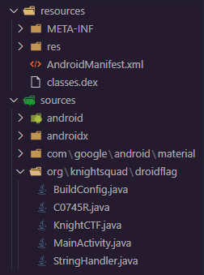
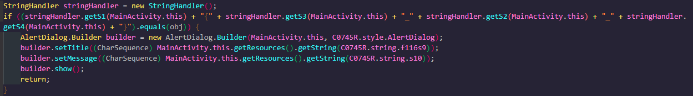
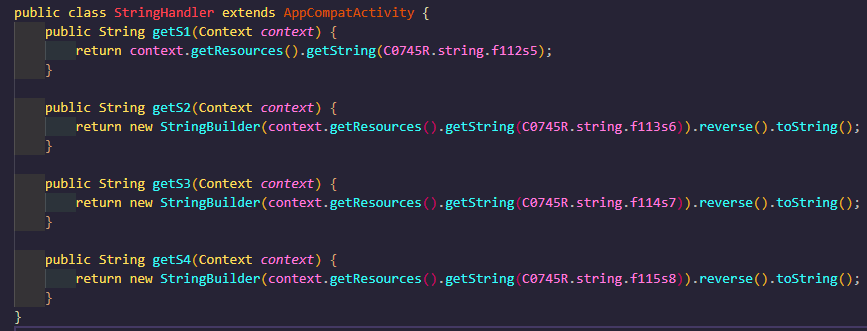
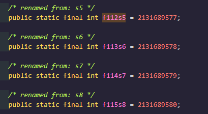
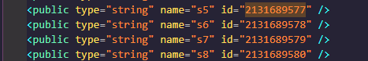
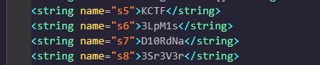

# DROID FLAG

- Date: `2022-01-24`
- Author: `AtomicNicos`
- Category: `Reverse Engineering`
- Points: `100`

## Challenge text

A Simple Android App to Validate KnightCTF flags.

[Download Link](https://kctf2022.nstechvalley.com/knight-ctf-2022-challenges/Reverse%20Engineering/Droid%20Flag/DroidFlag.zip)

Flag Format: `KCTF{SomE_T3xT_h3r3}`

## Description

One needs to decompile the provided APK, and understand what the decompiled code does, to retrieve the flag.

## Resolution

Once the ZIP is downloaded, extract the APK contained within, then go to [javadecompilers.com](https://www.javadecompilers.com/), and upload it there.

We obtain a ZIP which we then unpack, revealing the following file structure:

We can see a few interesting Java files, which we'll get into quickly.

The first is `MainActivity.java`, it contains a few interesting lines:

We can see that this code calls a number of functions in the `StringHandler` class from the `StringHandler.java` file, in the following order:

`$(S1){$(S3)_$(S2)_$(S4)}`

- S1 gets a value defined in class `C074SR` where the identifier is `f112s5`
- S2 gets a value defined in class `C074SR` where the identifier is `f113s6`
- S4 gets a value defined in class `C074SR` where the identifier is `f114s7`
- S4 gets a value defined in class `C074SR` where the identifier is `f115s8`

Those values are:

We look for any identifier with those numbers (grep is useful), and find some in `public.xml`

We then look for the names provided in `strings.xml`:

In `StringHandler.java` we see that the values for S2, S3 and S4 are then reversed, which makes the final flag:

`$(S1){$(S3)_$(S2)_$(S4)} -> KCTF{aNdR01D_s1MpL3_r3V3rS3}`

## Takeaways

Fun challenge, necessary to go a bit out and about to get things done.
