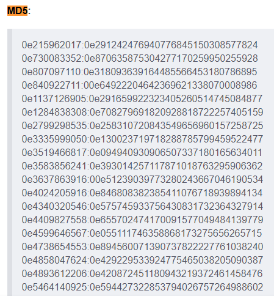

# Find Pass Code - 2

- Date: `2022-01-25`
- Author: `AtomicNicos`
- Category: `Web`
- Points: `150`

## Challenge text

Challenge Link : [http://find-pass-code-two.kshackzone.com/](http://find-pass-code-two.kshackzone.com/)

Flag Format : `KCTF{something_here}`

Note : Brute Force/Fuzzing not required and not allowed.

## Description

Find Pass Code 1 required the use to append `?source` to the URL in order to print out the page's PHP source code. From there we can find the correct passcode.

## Resolution

We first visit: `http://find-pass-code-two.kshackzone.com?source`, which gets us the following content (abridged):

<details>
  <summary>Explanation</summary>

```php
<?php
require "flag.php";
$old_pass_codes = array("0e215962017", "0e730083352", "0e807097110", "0e840922711");
$old_pass_flag = false;
if (isset($_POST["pass_code"]) && !is_array($_POST["pass_code"])) {
    foreach ($old_pass_codes as $old_pass_code) {
        if ($_POST["pass_code"] === $old_pass_code) {
            $old_pass_flag = true;
            break;
        }
    }
    if ($old_pass_flag) {
        echo "Sorry ! It's an old pass code.";
    } else if ($_POST["pass_code"] == md5($_POST["pass_code"])) {
        echo "KCTF Flag : {$flag}";
    } else {
        echo "Oh....My....God. You entered the wrong pass code.<br>";
    }
}
if (isset($_GET["source"])) {
    print show_source(__FILE__);
}
?>
<html>

<head>
    <!-- More -->
</head>

<body class="parent-div">
    <!-- Hi Serafin, I think you already know how you can view the source code :P
-->
    <!-- More -->
</html>
```
</details>
<br/>

The first thing that struck me was the fact that it was comparing the passcode entered against its MD5 hash. However, with one-way hashing functions, that shouldn't be the case (`H(X) != X`).

However, we can see the `$old_pass_codes = array("0e215962017", "0e730083352", "0e807097110", "0e840922711");` array, which piqued my curiosity.

I'd remembered a story on Twitter about magic hashes, habitually preceded by the number `0e`. (More here: [https://www.whitehatsec.com/blog/magic-hashes/](https://www.whitehatsec.com/blog/magic-hashes/))

So I searched for an index of magic hashes until I found this website: [https://blog.csdn.net/u013512548/article/details/108213295
](https://blog.csdn.net/u013512548/article/details/108213295
)



There were the 3 first hashes, so I took the fourth: `0e1137126905`.

Enter that into the platform and we get the flag: `KCTF{ShOuD_wE_cOmPaRe_MD5_LiKe_ThAt__Be_SmArT}`.

## Takeaways

Magic hashes are fun.