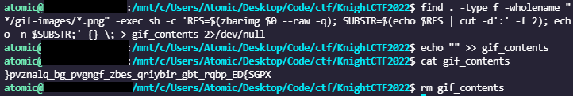
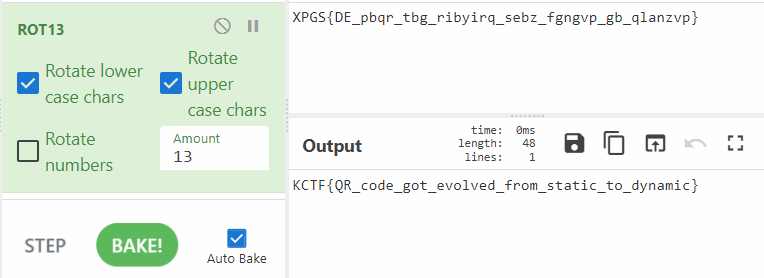

# QR Code from the Future

- Date: `2022-01-24`
- Author: `AtomicNicos`
- Category: `Steganography`
- Points: `100`

## Challenge text

The following file was found in a device from a crashed UFO. Can you solve that mystery?

[Download Link](https://kctf2022.nstechvalley.com/knight-ctf-2022-challenges/Steganography/QR_Code_From_The_Future/QR_Code_From_The_Future.gif)

Flag Format: `KCTF{SOME_text_here}`

## Description

Take the GIF, de-animate it, then read the flag's characters one by one.

## Resolution

The first step is to de-animate the GIF. For this, we can go to [EZGIF](https://ezgif.com/split) or use FFMPEG, like so:

```bash
mkdir ./gif-images
ffmpeg.exe -i .\QR_Code_From_The_Future.gif -vsync 0 gif-images/%02d.png
```

We can then use `zbarimg` (from the `zbar-tools`) to read the QR codes (zbarimg socket errrors can be expected and ignored):

```bash
find . -type f -wholename "*/gif-images/*.png" -exec sh -c 'RES=$(zbarimg $0 --raw -q); SUBSTR=$(echo $RES | cut -d':' -f 2); echo -n $SUBSTR;' {} \; > gif_contents 2>/dev/null
echo "" >> gif_contents
cat gif_contents
rm gif_contents
```

<details>
  <summary>Explanation</summary>
	FFMPEG takes the image provided with the GIF as input (`-i`), synchroneously (`-vsync 0`). It then saves it to `gif-images`, a directory that needs to exist.

	`%02` is so we don't have a flag out of order, it is just the number of leading zeros for that.

  Find checks all files in the directory `gif-images` that are PNG files. We feed each of these images to `zbarimg` which produces a code, which we store, remove the `QR-Code:` segment preceding it and append it to `gif_contents`.

	We then print out that file and then delete it.
</details>
<br/>



The data contained in the GIF is: `}pvznalq_bg_pvgngf_zbes_qriybir_gbt_rqbp_ED{SGPX`.

This looks like an upside down flag: `XPGS{DE_pbqr_tbg_ribyirq_sebz_fgngvp_gb_qlanzvp}`.

If we compare this to our habitual flag format (`KCTF`), we get that K is at position -13 from X, C is at position -13 from P, and so on.

The cipher is ROT-13, so we fire it up in CyberChef:



The flag is `KCTF{QR_code_got_evolved_from_static_to_dynamic}`.

## Takeaways

Interesting spin on steganography.